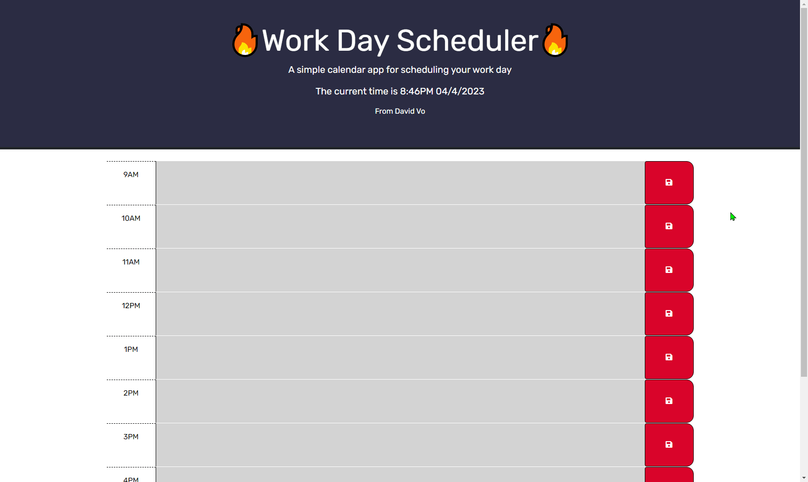

# Daily Schedule Planner

## Technologies Used
| Technology Used         | Resource URL           | 
| ------------- |:-------------:| 
| JavaScript | [https://developer.mozilla.org/en-US/docs/Web/JavaScript](https://developer.mozilla.org/en-US/docs/Web/JavaScript)     |  
| jQuery | [https://jquery.com/](https://jquery.com/)     |  
| Day.js | [https://day.js.org/en/](https://day.js.org/en/)     |  
| HTML    | [https://developer.mozilla.org/en-US/docs/Web/HTML](https://developer.mozilla.org/en-US/docs/Web/HTML) | 
| CSS     | [https://developer.mozilla.org/en-US/docs/Web/CSS](https://developer.mozilla.org/en-US/docs/Web/CSS)      |   
| Google Fonts | [https://fonts.google.com/](https://fonts.google.com/)     |  
| Git | [https://git-scm.com/](https://git-scm.com/)     |   

------------------

## Description 

[Click to View the Deployed Site](https://daevidvo.github.io/Daily_Schedule_Planner/)

It's not uncommon to believe that having a detailed schedule laid out for the day can help boost productivity.

That's why I built this simple and lightweight planner for anyone to use! 

Now, through the power of jQuery, Day.js, and JavaScript, we can plan out our day and have that information persist session to session.

----------------

## Table of Contents

* [Usage and Installation](#usage-and-installation)
* [Learning Points](#learning-points)
* [Author Info](#author-info)
* [License](#license)

-------------

## Usage and Installation

To use the planner, simply follow the steps below:

1. Visit the deployed site by [clicking here](https://daevidvo.github.io/Daily_Schedule_Planner/)
2. Find the hour block you'd like to fill out
3. In the box, fill in your activities
4. Click on the red "save" button to the right of the hour block you'd like to save
5. Done! Now when you refresh the page, your activities will be saved so you can refer to them later on

If you'd like to install the site, visit [the Github repository](https://github.com/daevidvo/Daily_Schedule_Planner) and either clone down the contents of the repo or download the repo as a .zip file.

Once you have the contents on your local machine, open index.html in your browser of choice and plan away! 🥳🥳🥳

----------------

## Learning Points

There were many valuable lessons as a developer that allowed me to create this website. However, I believe the most important lessons was simply learning how to use jQuery and Day.js

### **jQuery**

The majority of the DOM manipulation and traversing in this project was done through the use of jQuery.

Having gone through the roughs of jQuery, I found that it is a useful tool in shortening the amount of overall JavaScript that I have to write because of the many integrated functions in jQuery for adding elements, manipulating them, and traversing.

### **Day.js**

This is fairly self explanatory since Day.js doesn't have a lot of complicated functionality. 

Used mainly to figure out the current hour and to display the time in the planner, it's useful to know in case I build software in the future that require time-based functions.

-------------

## Author Info

### **David Vo**

* [Github](github.com/daevidvo)
* [LinkedIn](linkedin.com/in/daevidvo)
* [Instagram](instagram.com/daevidvo)

---------------

## License

MIT License

Copyright (c) 2023 daevidvo

Permission is hereby granted, free of charge, to any person obtaining a copy
of this software and associated documentation files (the "Software"), to deal
in the Software without restriction, including without limitation the rights
to use, copy, modify, merge, publish, distribute, sublicense, and/or sell
copies of the Software, and to permit persons to whom the Software is
furnished to do so, subject to the following conditions:

The above copyright notice and this permission notice shall be included in all
copies or substantial portions of the Software.

THE SOFTWARE IS PROVIDED "AS IS", WITHOUT WARRANTY OF ANY KIND, EXPRESS OR
IMPLIED, INCLUDING BUT NOT LIMITED TO THE WARRANTIES OF MERCHANTABILITY,
FITNESS FOR A PARTICULAR PURPOSE AND NONINFRINGEMENT. IN NO EVENT SHALL THE
AUTHORS OR COPYRIGHT HOLDERS BE LIABLE FOR ANY CLAIM, DAMAGES OR OTHER
LIABILITY, WHETHER IN AN ACTION OF CONTRACT, TORT OR OTHERWISE, ARISING FROM,
OUT OF OR IN CONNECTION WITH THE SOFTWARE OR THE USE OR OTHER DEALINGS IN THE
SOFTWARE.

-----------------------